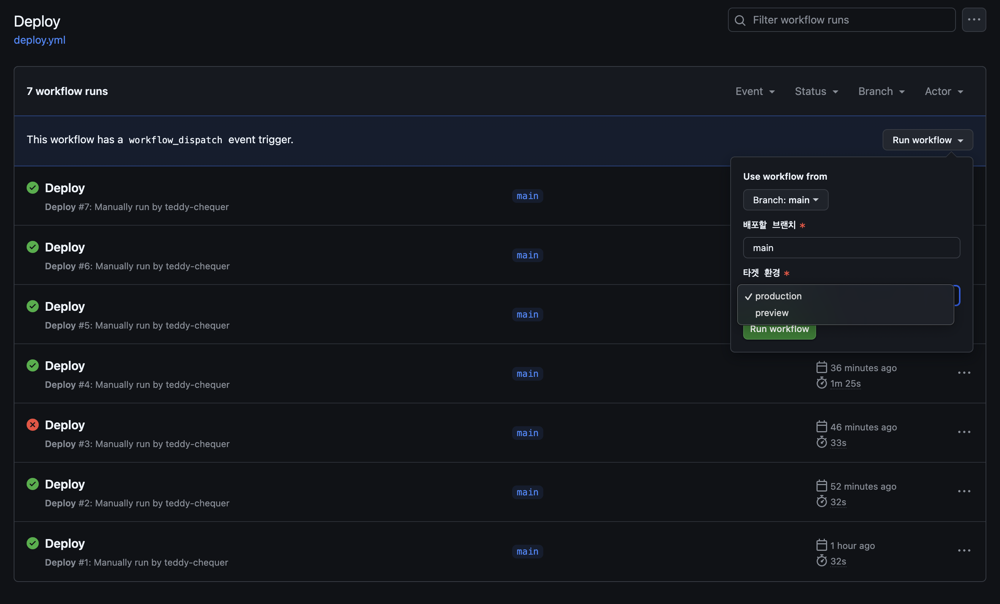
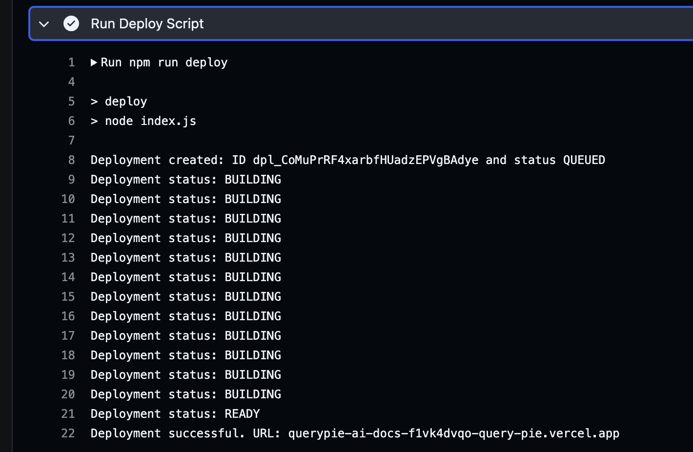

# querypie-docs
QueryPie 제품의 Docs를 관리하는 Git Repository입니다.

## 기술 스택
- Next.js 15
- React.js 19
- Nextra 4
- TypeScript 5

## 로컬 실행 방법
- 파일 고치면 고친게 바로 웹브라우저에 반영되나, 좀 느립니다.
- `http://localhost:3000`
```shell
npm run dev
```

## 빌드 및 실행
- 빌드 후 실행하면 Production과 마찬가지로 빠릅니다.
- `http://localhost:3000`
```shell
npm run build
npm start
```

## 배포 현황
2025-09-05 기준
- Vercel Project
  - https://vercel.com/querypie/querypie-docs
- Production Deployment
  - [ ] https://docs.querypie.com
  - [x] https://docs.querypie.io
  - [x] https://querypie-docs.vercel.app
- Staging Deployment
  - [ ] https://docs-staging.querypie.com
  - [x] https://docs-staging.querypie.io
- Preview Deployment
  - Vercel Deployment 마다 다른 URL 을 갖습니다.

### 배포 - GitHub Action
- [GitHub Actions](https://github.com/chequer-io/querypie-ai-docs/actions/workflows/deploy.yml) 에 접속합니다.
- `Run workflow`를 눌러서 알맞게 설정한 후 실행합니다.
    - `Delete on Production`: docs.querypie.com 에 배포하는 용도입니다.
    - `Delete on Staging`: docs-staging.querypie.com 에 배포하는 용도입니다. 자동 배포됩니다.
    - `Delete on Preview`: feature branch 의 결과를 미리 살펴보는데 사용합니다.

### 배포 관련 화면 스크린샷



### 배포 - Local Environment
- `scripts/deploy/` 디렉토리로 이동합니다.
- `npm install` 명령으로 Vercel SDK 등을 node_modules 에 설치합니다.
- `index.js`가 필요로 하는 환경변수를 설정합니다.
  - VERCEL_TOKEN: vercel.com 의 계정에서 생성한 Token 을 지정합니다. Scope 은 QueryPie team 을 지정합니다.
  - VERCEL_TEAM_ID: QueryPie team 의 Team ID 를 지정합니다. Settings -> General 에서 확인할 수 있습니다.
  - TARGET_ENV: production, staging, preview 중 하나를 지정합니다.
  - BRANCH: branch 이름을 지정합니다.
- `index.js`를 실행합니다.
```shell
TARGET_ENV=preview BRANCH=main node ./index.js
```

## 오픈 전 다음 파일 TODO 보고 로직이나 값 고쳐서 나가야 함
- src/middleware.ts
- scripts/generate-sitemap/index.js
- src/app/[lang]/layout.tsx
