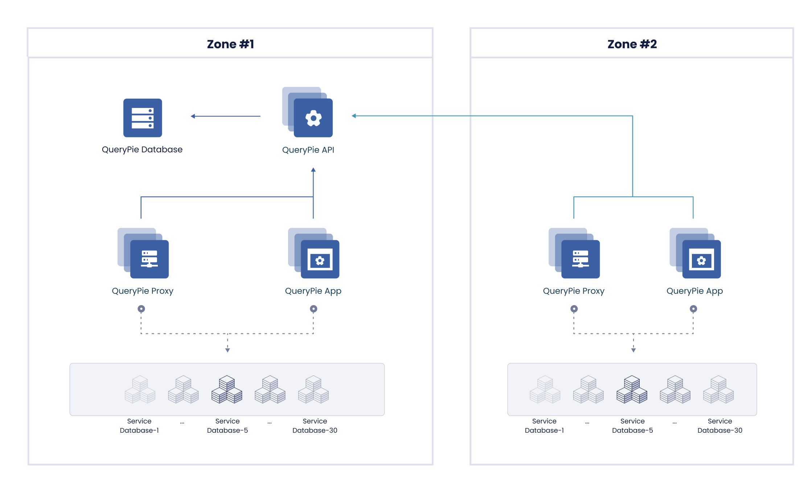
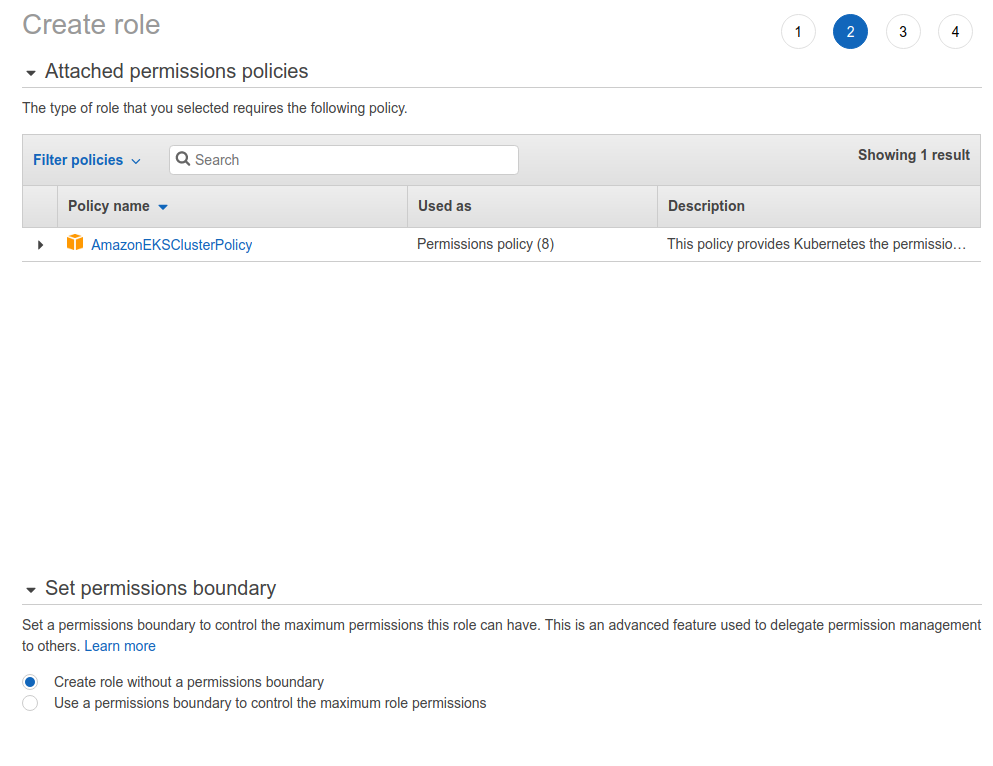
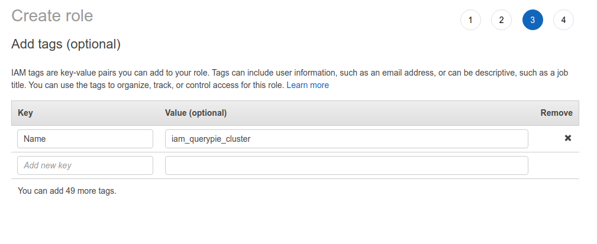
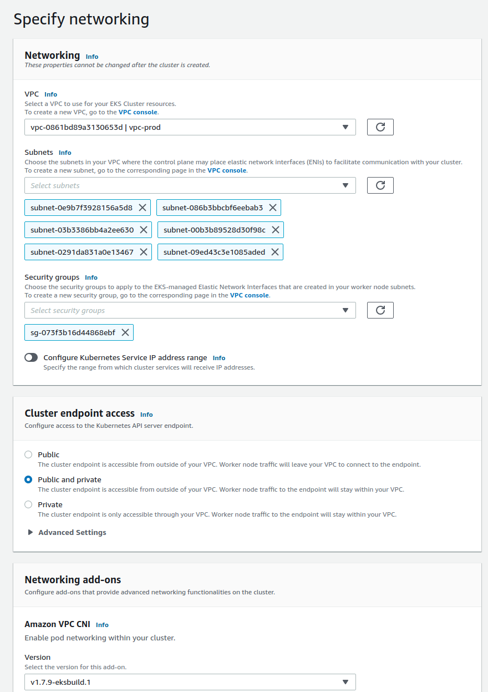
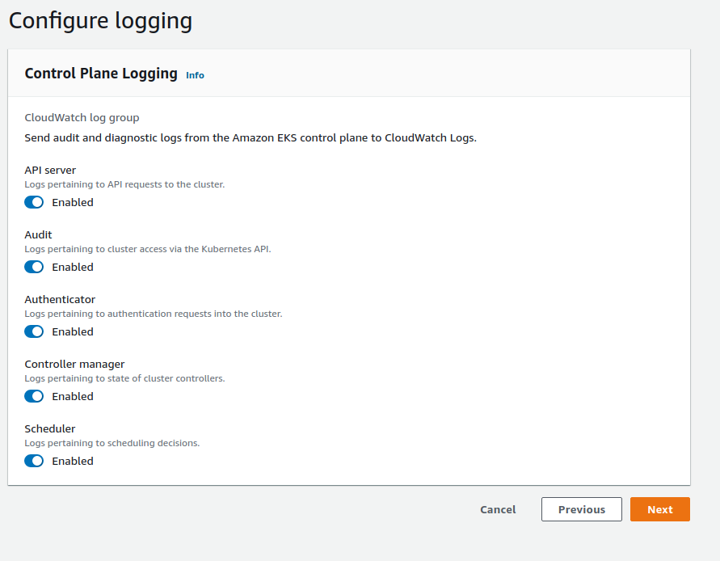
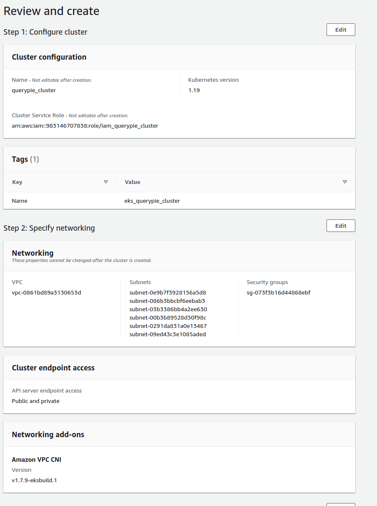
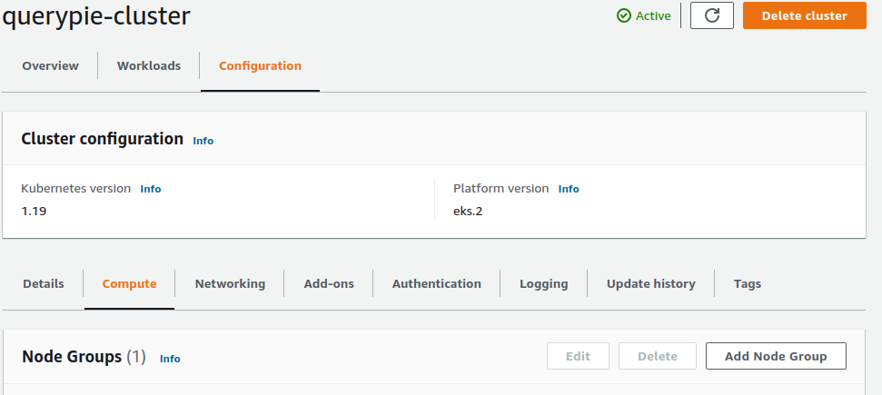
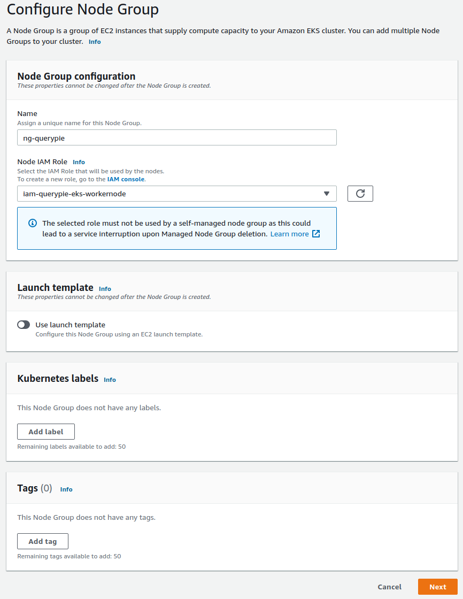
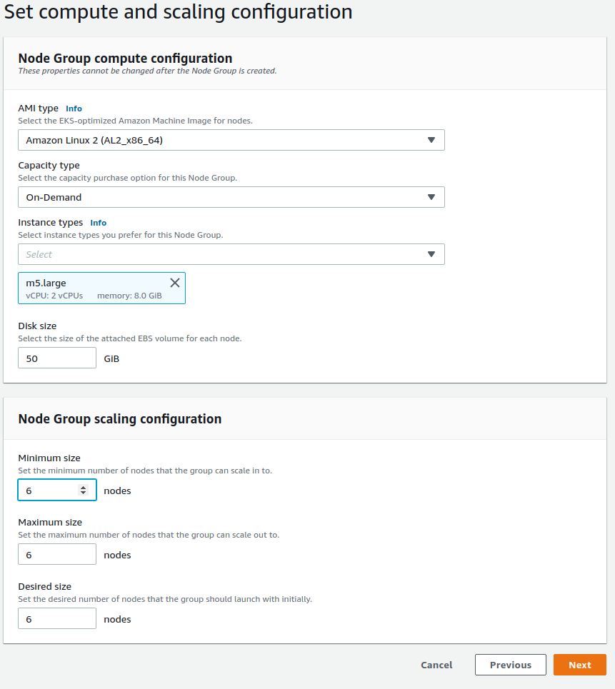
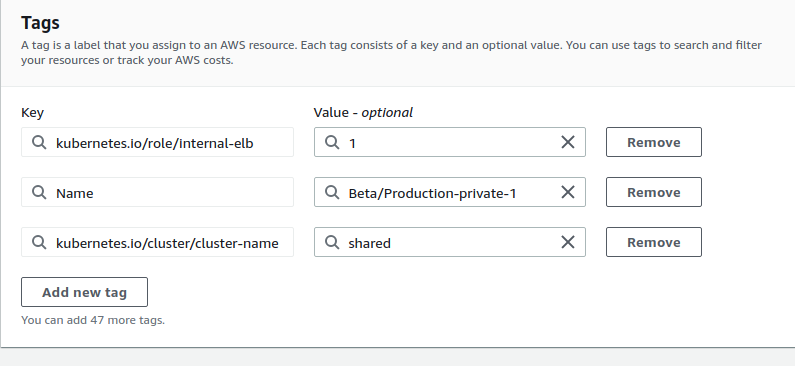

<h2>1. QueryPie Install Guide</h2>

<h3>1.1 Brief Architecture</h3>
* Install (Deploy) 을 위한 간단한 구조를 설명합니다.

  

<h3>1.2 Components</h3>
* 설명

| 컴포넌트 명 | 설명 |
| :--- | :--- |
|   QueryPie Api| User, Policy, Meta Data등을 관리하는 Rest Api 서버 |
|   QueryPie App | Web Sql Client, Management Console   |
|   QueryPie Proxy| DataGrip, Workbench를 위한 Proxy 서버  |
|   QueryPie DB| QueryPie 가 metadata 들을 관리하는 DB  |

<h2 id="2-mysql-install">2. QueryPie DB 설치</h2>

<h3>2.1 개요</h3>

* QueryPie 에서는 관리할 Database 들의 metadata 를 저장하기 위하여 MySQL 서버를 필요로 합니다.
* mysql 5.7을 권장합니다.
* 설치 및 업그레이드시 Table Schema 들을 적용하기 위하여 DDL, DML 권한이 필요합니다.
* Docker Image 를 띄울 때 해당 instance 의 정보를 Option 에 적어 주어야 합니다.

<h3>2.2 User 및 DB 생성 예제</h3> 

* MySQL 설치 후 database와 user를 생성해주어야 합니다.

  ```mysql
  CREATE USER 'querypie'@'%' IDENTIFIED BY 'password';

  CREATE database querypie CHARACTER SET utf8mb4 COLLATE utf8mb4_general_ci;

  GRANT ALL privileges ON querypie.* TO querypie@'%';
  ```

* Helm 을 이용한 설치시에는 xxx-values.yml에 이 MySQL정보를 Setting해 주십시오.

  ```yaml
    querypiedb:
      DB_PORT: 3306
      DB_HOST: ''
      DB_DATABASE: ''
      DB_MAX_CONNECTION_SIZE: 20
      credentials:
        DB_USERNAME: ''
        DB_PASSWORD: ''
  ```

<h2 id="3-redis-install">3. Redis 설치 (Optional)</h2>

<h3>3.1 개요</h3>

* QueryPie 에서는 Redis 서버를 내부적으로 사용하며, 설치 전 redis instance 가 준비되어 있어야 합니다.
* Redis 5 이상을 권장합니다.
* EKS 의 helm 을 사용하시는 경우에는 내부의 Redis를 사용하므로 따로 설치가 필요 없습니다.
* Docker Image 를 띄울 때 해당 instance 의 정보를 Option 에 적어 주어야 합니다.

<h2>4. QueryPie Docker Registry</h2>

<h3>4.1 개요</h3>

* QueryPie 는 docker image로 전달됩니다.
* QueryPie 의 컴포넌트들은 Private Docker Registry 에서 관리합니다.
* 인증 정보는 설치 가이드와 함께 전달됩니다.

<h3>4.2 Registry 정보</h3>
* Private Registry 

```text
domain name : dockerpie.querypie.com
public ip : 13.124.6.67
```

* On-Premise 환경에서 설치하시는 분들은 위 registry 에 접근이 가능하도록 Security Group 을 조정해주십시오.

* helm 을 통해 설치하시는 분들은 다음에서 지정이 가능합니다.

```yaml
imageCredentials:
  registry: 'dockerpie.querypie.com'
  username: 'username'
  password: 'password'
```

<h2>5. Deploy 예제</h2>
<h3>5.1 개요</h3>

* 단일 Zone 에서의 Deploy 구성도를 예제로 제시합니다.
* 여러 Zone 에서의 Deploy 구성도를 예제로 제시합니다.

<h3>5.2 단일 Zone 에서의 Deploy 구성도 예제</h3>

  


<h3>5.3 여러 Zone 에서의 Deploy 구성도 예제</h3>
  
  * Privacy Zone 등 여러 Network Zone으로 DB가 나누어져 있으나 모든 Zone들의 DB 는 QueryPie Api서버가 담당하게 됩니다.
  * 다음과 같은 구성으로 여러 Zone의 DB들을 한군데에서 관리 가능합니다.
  * 사용자 client를 제외한 구성도 입니다.

 

<h3>5.4 필요한 Protocol / Port</h3>

  * 포트는 각 사의 정책에 따라 변경 가능합니다. 문의 부탁드립니다.

| 네트워크 구간 | Protocol / Port |
| :--- | :--- |
|   Office, VDI ->  QueryPie App| https / 443 |
|   Office, VDI -> QueryPie Proxy | TCP / 40000:49999   |


<h2>6. QueryPie 설치 및 업데이트 - Helm</h2>

<h3>6.1 Prerequisites</h3>

* kubernetes 에 querypie를 설치하는 방법을 설명합니다.

* EKS를 사용하시는 분들은 [EKS 설정](#7-eks-setting) 를 참고해주십시오.

* GKE를 사용하시는 분들은 [GKE 설정](#8-gke-setting) 를 참고해주십시오.

* [helm](https://helm.sh) 을 사용하시기를 권장합니다.

* MySQL (>= 5.7.25) 가 필요합니다.

  [QueryPie DB 설치](#2-mysql-install) 를 참고해 주십시오.

* Redis (>= 5) 가 필요합니다. (Optional)

  [Redis 설치](#3-redis-install) 를 참고해 주십시오.
  helm을 이용하여 설치를 하실 경우에는 다음과 같이 설정해 주시면 따로 redis 설치가 필요 없습니다.

  ```yaml
  use_builtlin_redis: true
  ```

<h3>6.2 helm을 통한 Install</h3>

* helm 저장소를 추가 합니다.

  ```shell script
  helm repo add chequer https://chequer-io.github.io/querypie-deployment/helm-chart
  ```

* helm 저장소를 update 합니다.

  ```shell script
  helm repo update
  ```

* 각 환경에 맞는 values.yaml 를 작성하여 QueryPie 를 install 합니다.

    ```shell script
    helm install querypie chequer/querypie --create-namespace -n querypie -f xxxx-values.yaml
    ```

<h3>6.3 helm 을 통한 update</h3>

* helm 을 이용하여 쉽게 update 를 할 수 있습니다.

    ```shell script
    helm upgrade querypie chequer/querypie -n querypie -f xxxx-values.yaml
    ```

<h3>6.4 Sample values.yaml - for EKS</h3>

* 아래를 참고 하시어 xxxx-values.yaml 를 작성해주시면 됩니다.

    ```yaml
    apiImage:
      repository: dockerpie.querypie.com/chequer.io/querypie-api
      tag: 8.2.1
      pullPolicy: Always
      replicas: 2
    
    appImage:
      repository: dockerpie.querypie.com/chequer.io/querypie-app
      tag: 8.2.1
      pullPolicy: Always
      replicas: 2
  
    proxyImage:
      repository: dockerpie.querypie.com/chequer.io/querypie-app
      tag: 8.2.1
      pullPolicy: Always
      replicas: 2
    
    querypiedb:
      DB_PORT: 3306
      DB_HOST: ''
      DB_DATABASE: ''
      DB_MAX_CONNECTION_SIZE: 20
      credentials:
        DB_USERNAME: ''
        DB_PASSWORD: ''
    
    imageCredentials:
      registry: 'dockerpie.querypie.com'
      username: ''
      password: ''
    
    appIngress:
      tls: true
      hostname: '*.querypie.com'
      secretName: null
      annotations:
        kubernetes.io/ingress.class: alb
        alb.ingress.kubernetes.io/scheme: internet-facing
        alb.ingress.kubernetes.io/target-type: ip
        alb.ingress.kubernetes.io/target-group-attributes: stickiness.enabled=true,stickiness.lb_cookie.duration_seconds=86400
        alb.ingress.kubernetes.io/inbound-cidrs: 127.0.0.1/32, 172.0.0.1/32
        alb.ingress.kubernetes.io/listen-ports: '[{"HTTP":80}, {"HTTPS":443}]'
        alb.ingress.kubernetes.io/certificate-arn: arn:aws:acm:ap-northeast-2:xxxxx:certificate/xxxxx-4d47-493d-85b5-e4086b1e85c1
        alb.ingress.kubernetes.io/actions.ssl-redirect: '{"Type": "redirect", "RedirectConfig": { "Protocol": "HTTPS", "Port": "443", "StatusCode": "HTTP_301"}}'
        nginx.ingress.kubernetes.io/configuration-snippet: |
          real_ip_header X-Forwarded-For;
          set_real_ip_from 0.0.0.0/0;
          proxy_set_header X-QueryPie-Company-Code $http_x-querypie-company-code;
      rules:
        - http:
            paths:
              - path: /*
                backend:
                  serviceName: querypie-app-service
                  servicePort: 80
    
    apiIngress:
      tls: true
      hostname: '*.querypie.com'
      secretName: null
      annotations:
        kubernetes.io/ingress.class: alb
        alb.ingress.kubernetes.io/scheme: internet-facing
        alb.ingress.kubernetes.io/target-type: ip
        alb.ingress.kubernetes.io/target-group-attributes: stickiness.enabled=true,stickiness.lb_cookie.duration_seconds=86400
        alb.ingress.kubernetes.io/inbound-cidrs: 127.0.0.1/32, 172.0.0.1/32
        alb.ingress.kubernetes.io/listen-ports: '[{"HTTP":80}, {"HTTPS":443}]'
        alb.ingress.kubernetes.io/certificate-arn: arn:aws:acm:ap-northeast-2:xxxxx:certificate/xxxx-4d47-493d-85b5-e4086b1e85c1
        alb.ingress.kubernetes.io/actions.ssl-redirect: '{"Type": "redirect", "RedirectConfig": { "Protocol": "HTTPS", "Port": "443", "StatusCode": "HTTP_301"}}'
        nginx.ingress.kubernetes.io/configuration-snippet: |
          real_ip_header X-Forwarded-For;
          set_real_ip_from 0.0.0.0/0;
          proxy_set_header X-QueryPie-Company-Code $http_x-querypie-company-code;
      rules:
        - http:
            paths:
              - path: /*
                backend:
                  serviceName: querypie-api-service
                  servicePort: 80
    
    use_builtin_redis: true
    ```

<h2 id="7-eks-setting">7. EKS 설정</h2>

* QueryPie를 AWS상에서 효율적으로 설치하고 최신으로 유지하는 방법은 EKS상에서 운영하는 것입니다.

<h3>7.1 QueryPie를 위한 EKS cluster 생성</h3>
* 이미 기존의 cluster가 있으시거나, 익숙하신 분들은 이 단계를 건너 뛰십시오.

* cluster를 위한 IAM Role을 [생성](https://console.aws.amazon.com/iam/home?region=ap-northeast-2#/roles$new?step=type)합니다.
  * 이 가이드에서는 <strong>iam_querypie_cluster</strong>의 이름으로 생성합니다.
  
    * type은 EKS - Cluster를 선택합니다.
    
    

    * Attached Permissions 를 확인합니다.
    
    

    * 필요한 Tagging을 진행합니다. (Optional)
    
    

    * 확인 후 생성을 완료합니다.
    
    


* cluster를 생성합니다.
  * 원하시는 region에서 [EKS > Clusters > Create EKS cluster](https://ap-northeast-2.console.aws.amazon.com/eks/home?region=ap-northeast-2#/cluster-create)를 클릭하여 진행합니다.
    
    * version은 1.18 이상을 선택합니다.
    
    * Cluster Service Role에서는 위에서 생성한 <strong>iam_querypie_cluster</strong> 를 선택합니다.
    
    * Tags를 지정합니다. (optional)

    
    
    * Netwoking은 설치 되는 환경에 맞추어 설정합니다.
      
    
    
    * Logging은 켜시는 것을 권장합니다. (optional)

    

    * Review 후 생성 완료합니다.

    

* Node Group을 위한 IAM을 생성합니다.
  * Node Group을 위한 필수 IAM Policy는 다음과 같습니다.
  
    | Policy | 비고 |
    | :--- | :--- |
    | AmazonEKSWorkerNodePolicy| Default |
    | AmazonEC2ContainerRegistryReadOnly | Default |
    | AmazonDynamoDBReadOnlyAccess | DynamoDB의 정보를 읽어와 등록하기 위하여 필요합니다.|
    | AmazonRDSReadOnlyAccess | RDS의 정보를 읽어와 등록하기 위하여 필요합니다. |
    | AmazonEKS_CNI_Policy | Default |

* Node Group 생성
  * EKS > Clusters > cluster 이름 > Configuration > Compute > Add Node Group을 통해 Node Group을 생성합니다.

    * Add Node Group

    
    
    * 위에서 생성한 IAM Policy를 지정해 줍니다.

    
    
    * 권장하는 Node Group은 m5.large 6 instance 이상의 구성입니다.

    


* AWS Load Balancer Controller 설치
  * alb 사용을 위하여 다음의 설치를 권장합니다.
  * 직접 alb를 운영하시는 경우 sticky option

  ```html
  https://github.com/kubernetes-sigs/aws-load-balancer-controller
  ```
  [Load Balancer Controller Installation](https://kubernetes-sigs.github.io/aws-load-balancer-controller/latest/deploy/installation/) 을 참고해주십시오.

  * cluster를 직접 생성한 경우 subnet auto discovery를 위하여 subnets에 tagging을 해주어야하는 경우가 있습니다.
  다음 링크를 참조하여 tagging을 해주십시오.
    
  [auto subnet discovery](https://aws.amazon.com/ko/premiumsupport/knowledge-center/eks-vpc-subnet-discovery)
  
  


<h2 id="8-gke-setting">8. GKE 설정</h2>

<h3>8.1 Prerequisites</h3>

* QueryPie를 GCP상에서 효율적으로 설치하고 최신으로 유지하는 방법은 GKE상에서 운영하는 것입니다.

* [Google Cloud SDK](https://cloud.google.com/sdk/docs/install) 를 먼저 설치해주십시오.

* kubernetes api를 enable 해주십시오.
  
   ```shell
   gcloud services enable container.googleapis.com
   ```  

* IAM Service Account Credentials api를 enable 해주십시오.

   ```shell
    gcloud services enable iamcredentials.googleapis.com
   ```

* sqladmin api 를 enable 해주십시오.

  ```shell
  gcloud services enable sqladmin.googleapis.com
  ```
  
* 다음의 권한들이 필요합니다.
  ```shell
  container.clusters.create
  container.clusters.update
  iam.serviceAccounts.setIamPolicy
  ```

<h3>8.2 Project 생성</h3>

* 이미 project가 생성되어 있다면 이 과정은 생략해주십시오.

  <pre><code lang="shell script">gcloud projects create <b>PROJECT_ID</b> --organization=<b>RGANIZATION_ID</b></code></pre>

  예제).
  ```shell
  gcloud projects create querypie --organization=614642268215
  ```

<h3>8.3 GKE Cluster 생성</h3>

* 이미 cluster가 생성되어 있다면 이 과정은 생략해주십시오.

  <pre><code lang="shell script">gcloud container clusters create querypie --zone <b>ZONE_ID</b> --project <b>PROJECT_ID</b> --workload-pool=<b>PROJECT_ID</b>.svc.id.goog --workload-metadata=GKE_METADATA</code></pre>

  예제).
  ```shell
  gcloud container clusters create querypie --zone asia-northeast3-a --project chequer --workload-pool=querypie.svc.id.goog --workload-metadata=GKE_METADATA
  ```

* 생성된 cluster는 다음과 같이 확인이 가능합니다.

   예제).
   ```shell
   gcloud container clusters describe querypie --zone 'asia-northeast3-a'
   ```

* cluster와 통신하기 위하여 kubectl 을 구성합니다.

   예제).
   ```shell
   gcloud container clusters get-credentials querypie --zone asia-northeast3-a --project querypie
   ```
  
<h3>8.4 Google Service Account 생성</h3>

* google service account를 생성합니다.

   <pre><code lang="shell">gcloud iam service-accounts create <b>GSA_NAME</b></code></pre>

   예제).
   ```shell
   gcloud iam service-accounts create querypie
   ```
  
* google service account를 만들고 이를 kubernetes의 service account가 google service account로 동작하도록 허용합니다.
  
  <pre><code lang="shell">gcloud iam service-accounts add-iam-policy-binding \
    --role roles/iam.workloadIdentityUser \
    --member "serviceAccount:querypie.svc.id.goog[<b>K8S_NAMESPACE</b>/<b>KSA_NAME</b>]" \
    <b>GSA_NAME</b>@<b>PROJECT_ID</b>.iam.gserviceaccount.com</code></pre>

  예제).

* 기존에 설치된 querypie가 있다면 다음과 같이 kubernetes 의 service account에 annotation을 추가해줍니다.

  <pre><code lang="shell">
  kubectl annotate serviceaccount \
  --namespace <b>K8S_NAMESPACE</b> \
  <b>KSA_NAME</b> \
  iam.gke.io/gcp-service-account=GSA_NAME@PROJECT_ID.iam.gserviceaccount.com</code></pre>

  예제).
   ```shell
  kubectl annotate serviceaccount \
  --namespace <b>querypie</b> \
  <b>querypie</b> \
  iam.gke.io/gcp-service-account=querypie@querypie.iam.gserviceaccount.com
   ```

<h3>8.5. Tips</h3>

* 다음을 미리 환경변수에 지정해 두시면 ZONE, CLUSTER, PROJECT를 매번 gcloud의 parameter로 넘기지 않으셔도 됩니다.

   ```shell
    export PROJECT=$(gcloud config list project --format "value(core.project)" )
    export CLUSTER=workload-id
    export ZONE=asia-northeast3-a
    gcloud config set compute/zone $ZONE
    gcloud config set compute/region asia-northeast3-a
    ```

<h2>9. Docker Compose를 이용한 Deploy</h2>

* 간단하게 단일 VM에 띄워서 운영하기 위해서는 docker-compose를 사용하시는 것이 좋습니다.
* VM은 최소 4Core, 16GB 이상을 권장합니다.  
* docker 는 20.10.x 이상을 권장해드립니다.
* 다음은 docker-compose.yml의 예제입니다. 다음 변수들을 환경에 맞게 조정해주십시오.
* 참고 file을 에 올려둡니다. [예제 파일](https://github.com/chequer-io/querypie-deployment/raw/master/docker-compose/docker-compose-example.zip)

  | Policy | 비고 |
  | :--- | :--- |
  | redis_password| redis password (없는 경우 공백) |
  | db_host | querypie backend db의 호스트 |
  | db_username | querypie backend db의 username|
  | db_password | querypie backend db의 password |

  ```yaml
  version: "3.9"

  volumes:
    redis_data:
      driver: local

  services:
    redis-server:
      image: 'dockerpie.querypie.com/chequer.io/redis:6.0-debian-10'
      healthcheck:
        test: [ "CMD", "redis-cli", "-a","${redis_password}", "ping" ]
        interval: 1s
        timeout: 3s
        retries: 30
      environment:
        - ALLOW_EMPTY_PASSWORD=no
        - REDIS_DISABLE_COMMANDS=FLUSHDB,FLUSHALL
        - REDIS_PASSWORD=${redis_password}
        - REDIS_AOF_ENABLED=no
      command: /opt/bitnami/scripts/redis/run.sh --maxmemory 1024mb
      ports:
        - '6379:6379'
      volumes:
        - redis_data:/redis/data

    querypie-api:
      depends_on:
        db:
          condition: service_started
      image: dockerpie.querypie.com/chequer.io/querypie-api:8.4.1
      healthcheck:
        test: ["CMD", "wget", "-nv", "http://localhost:8080/health"]
        start_period: 120s
        interval: 5s
        timeout: 3s
        retries: 5
      ports:
        - 8080:80
      environment:
        - DB_DRIVER_CLASS=com.mysql.cj.jdbc.Driver
        - DB_JDBC_URL=jdbc:mysql://${db_host}:3306/querypie?useSSL=false&autoReconnect=true&validationQuery=select 1&useUnicode=true&characterEncoding=UTF-8&allowPublicKeyRetrieval=true&serverTimezone=UTC
        - DB_USERNAME=${db_username}
        - DB_PASSWORD=${db_password}
        - DB_MAX_CONNECTION_SIZE=30

    querypie-app:
      depends_on:
        redis-server:
          condition: service_healthy
      image: dockerpie.querypie.com/chequer.io/querypie-app:8.4.1
      ports:
        - 3000:3000
      environment:
        - PORT=3000
        - NODE_ENV=production
        - APP_ENV=master
        - API_URL=http://querypie-api:8080
        - REDIS_HOST=redis-server
        - REDIS_PORT=6379
        - REDIS_PASSWORD=${redis_password}
        - REDIS_EVENTKEY=master
        - REDIS_DB=0
        - TZ=Asia/Seoul
      links:
        - querypie-api

    querypie-nginx:
      image: dockerpie.querypie.com/chequer.io/nginx:1.19.8
      volumes:
        - ./nginx/nginx.conf:/etc/nginx/nginx.conf
      ports:
        - 80:80
      links:
        - querypie-app
  ```
