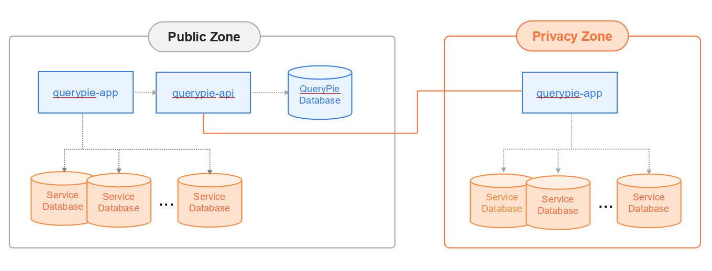

<h2>1. QueryPie Install Guide</h2>

<h3>1.1 Brief Architecture</h3>
* Install (Deploy) 을 위한 간단한 구조를 설명합니다.

  

<h3>1.2 Components</h3>
* 설명

| 컴포넌트 명 | 설명 |
| :---: | :---: |
|   QueryPie Api| Rest Api 서버  & Admin|
|   QueryPie App | QueryPie 의 Web Client   |
|   QueryPie DB| QueryPie 가 metadata 들을 관리하는 DB  |

<h2 id="2-mysql-install">2. QueryPie DB 설치</h2>

<h3>2.1 개요</h3>

* QueryPie 에서는 관리할 Database 들의 metadata 를 저장하기 위하여 MySQL 서버를 필요로 합니다.
* mysql 5.7을 권장합니다.
* 설치 및 업그레이드시 Table Schema 들을 적용하기 위하여 DDL, DML 권한이 필요합니다.
* Docker Image 를 띄울 때 해당 instance 의 정보를 Option 에 적어 주어야 합니다.

<h3>2.2 User 및 DB 생성 예제</h3> 

* MySQL 설치 후 database와 user를 생성해주어야 합니다.

  ```mysql
  CREATE USER 'querypie'@'%' IDENTIFIED BY 'password';

  CREATE database querypie CHARACTER SET utf8mb4 COLLATE utf8mb4_general_ci;

  GRANT ALL privileges ON querypie.* TO querypie@'%';
  ```

* Helm 을 이용한 설치시에는 아래에 MySQL정보를 Setting해 주십시오.

  ```yaml
    querypiedb:
      DB_PORT: 3306
      DB_HOST: ''
      DB_DATABASE: ''
      DB_MAX_CONNECTION_SIZE: 20
      credentials:
        DB_USERNAME: ''
        DB_PASSWORD: ''
  ```

<h2 id="3-redis-install">3. Redis 설치 (Optional)</h2>

<h3>3.1 개요</h3>

* QueryPie 에서는 Redis 서버를 내부적으로 사용하며, 설치 전 redis instance 가 준비되어 있어야 합니다.
* Redis 5 이상을 권장합니다.
* EKS 의 helm 을 사용하시는 분들은 자동으로 설치가 됩니다.
* Docker Image 를 띄울 때 해당 instance 의 정보를 Option 에 적어 주어야 합니다.

<h2>4. QueryPie Docker Registry</h2>

<h3>4.1 개요</h3>

* QueryPie 는 docker image로 전달됩니다.
* QueryPie 의 컴포넌트들은 Private Docker Registry 에서 관리합니다.
* 인증 정보는 설치 가이드와 함께 전달됩니다.

<h3>4.2 Registry 정보</h3>
* Private Registry 

```text
domain name : dockerpie.querypie.com
public ip : 13.124.6.67
```

* On-Premise 환경에서 설치하시는 분들은 위 registry 에 접근이 가능하도록 Security Group 을 조정해주십시오.

* helm 을 통해 설치하시는 분들은 다음에서 지정이 가능합니다.

```yaml
imageCredentials:
  registry: 'dockerpie.querypie.com'
  username: 'username'
  password: 'password'
```

<h2>5. Deploy 예제</h2>
<h3>5.1 개요</h3>

* Public Zone 에서의 Deploy 구성도를 예제로 제시합니다.
* Privacy Zone 에서의 Deploy 구성도를 예제로 제시합니다.

<h3>5.2 Public Zone 에서의 Deploy 구성도 예제</h3>

  


<h3>5.3 Privacy Zone 에서의 Deploy 구성도 예제</h3>

 

<h2>6. QueryPie 배포 - EKS</h2>

<h3>6.1 Prerequisites</h3>

* [helm](https://helm.sh) 을 사용하시기를 권장합니다.

* QueryPie 의 경우 Sticky Session 을 위하여 AWS Load Balancer Controller 사용이 요구 됩니다.

  ```html
  https://github.com/aws/eks-charts/tree/master/stable/aws-load-balancer-controller
  ```

* MySQL (>= 5.7.25) 가 필요합니다.

  [QueryPie DB 설치](#2-mysql-install) 를 참고해 주십시오.

* Redis (>= 5) 가 필요합니다. (Optional)

  [Redis 설치](#3-redis-install) 를 참고해 주십시오.
  helm 을 이용하여 설치를 하실 경우에는 다음과 같이 설정해 주시면 따로 redis 설치가 필요 없습니다.

  ```yaml
  use_intenal_redis: true
  ```

<h3>6.2 helm을 통한 Install</h3>

* helm 저장소를 추가 합니다.

  ```shell script
  helm repo add chequer https://chequer-io.github.io/querypie-deployment/helm-chart
  ```

* helm 저장소를 update 합니다.

  ```shell script
  helm repo update
  ```

* 각 환경에 맞는 values.yaml 를 작성하여 QueryPie 를 install 합니다.

    ```shell script
    helm install querypie chequer/querypie --create-namespace -n chequer-querypie -f xxxx-values.yaml --version=0.1.21
    ```
  
<h3>6.3 helm 을 통한 update</h3>

* helm 을 이용하여 쉽게 update 를 할 수 있습니다. 

    ```shell script
    helm upgrade querypie chequer/querypie -n chequer-querypie -f xxxx-values.yaml --version=0.1.22
    ```

<h3>6.4 Sample values.yaml</h3>

* 아래를 참고 하시어 xxxx-values.yaml 를 작성해주시면 됩니다.

    ```yaml
    apiImage:
      repository: dockerpie.querypie.com/chequer.io/querypie-api
      tag: alpha
      pullPolicy: Always
      replicas: 2
    
    appImage:
      repository: dockerpie.querypie.com/chequer.io/querypie-app
      tag: alpha
      pullPolicy: Always
      replicas: 2
    
    querypiedb:
      DB_PORT: 3306
      DB_HOST: ''
      DB_DATABASE: ''
      DB_MAX_CONNECTION_SIZE: 20
      credentials:
        DB_USERNAME: ''
        DB_PASSWORD: ''
    
    imageCredentials:
      registry: 'dockerpie.querypie.com'
      username: ''
      password: ''
    
    appIngress:
      tls: true
      hostname: '*.querypie.com'
      secretName: null
      annotations:
        kubernetes.io/ingress.class: alb
        alb.ingress.kubernetes.io/scheme: internet-facing
        alb.ingress.kubernetes.io/target-type: ip
        alb.ingress.kubernetes.io/target-group-attributes: stickiness.enabled=true,stickiness.lb_cookie.duration_seconds=86400
        alb.ingress.kubernetes.io/inbound-cidrs: 127.0.0.1/32, 172.0.0.1/32
        alb.ingress.kubernetes.io/listen-ports: '[{"HTTP":80}, {"HTTPS":443}]'
        alb.ingress.kubernetes.io/certificate-arn: arn:aws:acm:ap-northeast-2:xxxxx:certificate/xxxxx-4d47-493d-85b5-e4086b1e85c1
        alb.ingress.kubernetes.io/actions.ssl-redirect: '{"Type": "redirect", "RedirectConfig": { "Protocol": "HTTPS", "Port": "443", "StatusCode": "HTTP_301"}}'
        nginx.ingress.kubernetes.io/configuration-snippet: |
          real_ip_header X-Forwarded-For;
          set_real_ip_from 0.0.0.0/0;
          proxy_set_header X-QueryPie-Company-Code $http_x-querypie-company-code;
      rules:
        - http:
            paths:
              - path: /*
                backend:
                  serviceName: querypie-app-service
                  servicePort: 80
    
    apiIngress:
      tls: true
      hostname: '*.querypie.com'
      secretName: null
      annotations:
        kubernetes.io/ingress.class: alb
        alb.ingress.kubernetes.io/scheme: internet-facing
        alb.ingress.kubernetes.io/target-type: ip
        alb.ingress.kubernetes.io/target-group-attributes: stickiness.enabled=true,stickiness.lb_cookie.duration_seconds=86400
        alb.ingress.kubernetes.io/inbound-cidrs: 127.0.0.1/32, 172.0.0.1/32
        alb.ingress.kubernetes.io/listen-ports: '[{"HTTP":80}, {"HTTPS":443}]'
        alb.ingress.kubernetes.io/certificate-arn: arn:aws:acm:ap-northeast-2:xxxxx:certificate/xxxx-4d47-493d-85b5-e4086b1e85c1
        alb.ingress.kubernetes.io/actions.ssl-redirect: '{"Type": "redirect", "RedirectConfig": { "Protocol": "HTTPS", "Port": "443", "StatusCode": "HTTP_301"}}'
        nginx.ingress.kubernetes.io/configuration-snippet: |
          real_ip_header X-Forwarded-For;
          set_real_ip_from 0.0.0.0/0;
          proxy_set_header X-QueryPie-Company-Code $http_x-querypie-company-code;
      rules:
        - http:
            paths:
              - path: /*
                backend:
                  serviceName: querypie-api-service
                  servicePort: 80
    
    use_intenal_redis: true
    ```
