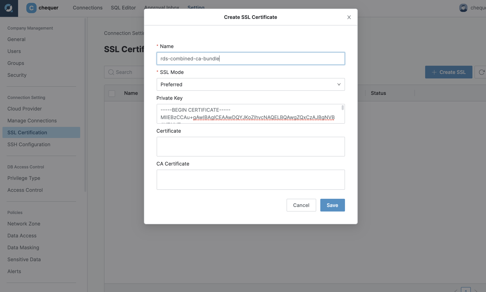
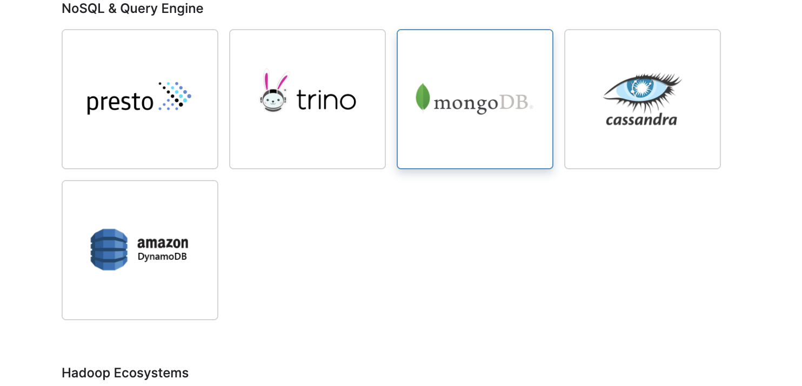
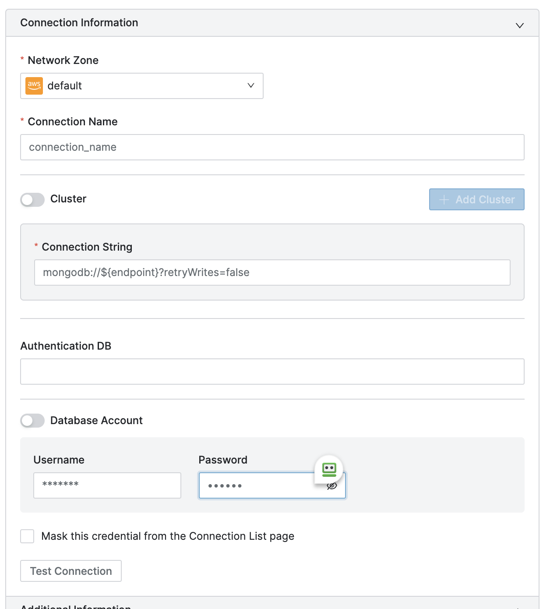
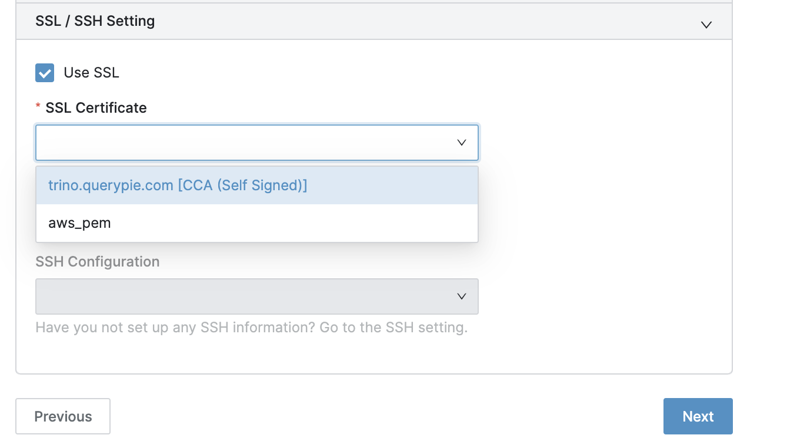

<h2>1. Document DB 접속 Guide</h2>

document db는 기본적으로 private 영역에 생성이 됩니다.

그래서 document db에 접속하기 위해서는

1. querypie app 과 document db가 같은 vpc에 존재하거나
2. querypie app 이 설치된 vpc와 document db가 설치된 vpc가 peering 이 되어 있거나
3. ssh tunnelling 을 통해 접근해야합니다.

<h3>1.1 인증서 등록 - TLS 연결의 경우</h3>

   먼저 인증서를 다운로드 받습니다.

   ```shell
   wget https://s3.amazonaws.com/rds-downloads/rds-combined-ca-bundle.pem
   ```

   이 내용을  SSL Certificate 메뉴의 Private key 에 등록하여 저장합니다.

   

  | Name | SSL Mode | Private Key | Certificate | CA Certificate |
  | :--- | :--- | :--- | :--- | :--- |
  |   구분가능한 인증서 이름 | Preferred | rds-combined-ca-bundle.pem의 내용 | 빈 값 | 빈 값 |

  ***추후 버전 업데이트 이후에는 이 절차는 사라집니다. (QueryPie 에서 내장 예정)***

<h3>1.2 Connection  정보 등록 - VPC Peering 이 되어 있거나 같은 VPC에 위치한 경우</h3>

  * Setting > Connection Setting > Manage Connections 메뉴를 들어갑니다.

  * 여기서 Create Connection 을 클릭하여 MongoDB 를 선택합니다.

  

  | Connection String |
  | :--- |
  | mongodb://${endpoint}?retryWrites=false |

  

  * TLS 의 경우 SSL / SSH Setting 에서 1.1 에서 만든 인증서를 선택합니다. (TLS 가 Disable 인 경우 Skip 합니다.)

  

<h3>1.3 Connection  정보 등록 - SSH 터널링 이용</h3>

   TODO : 작성하기
  
  