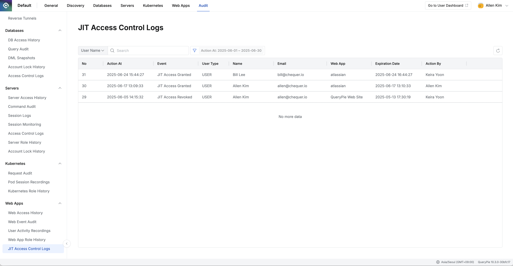

## Overview

조직에서 관리하는 웹 애플리케이션 JIT(Just-In-Time) 접근 제어 로그 이력을 기록합니다.

## JIT Access Control Logs 조회하기

*Administrator &gt; Audit &gt; Web Apps &gt; JIT Access Control Logs*

1. Administrator &gt; Audit &gt; Web Apps &gt; JIT Access Control Logs 메뉴로 이동합니다.
2. 현재 월 기준으로 로그가 내림차순으로 조회됩니다.
3. 테이블 최측 상단의 검색란을 통해 아래와 조건으로 검색이 가능합니다. a.  **User Name**  : 사용자 이름 b.  **User Email**  : 사용자 이메일 c.  **Web App Name**  : 웹 애플리케이션 이름
4. 검색 필드 우측 필터 버튼을 클릭하여 AND 조건으로 아래와 필터링이 가능합니다.
    1.  **Event**  : 이벤트 유형 (JIT Access Granted/JIT Access Revoked)
    2.  **Action At**  : 액션 발생 일시 범위
5. 테이블 우측 상단의 새로고침 버튼을 통해 로그 목록을 최신화할 수 있습니다.
6. 테이블에서 아래와 같은 정보를 제공합니다:
    1.  **No**  : 순번
    2.  **Action At**  : 액션 발생 일시
    3.  **Event**  : 이벤트 유형 (JIT Access Granted, JIT Access Revoked)
    4.  **User Type**  : 사용자 유형 (USER)
    5.  **Name**  : 사용자명
    6.  **Email**  : 사용자 이메일
    7.  **Web App**  : 웹 애플리케이션명
    8.  **Expiration Date**  : JIT 접근 권한 만료 일시
    9.  **Action By**  : 액션을 수행한 관리자명
