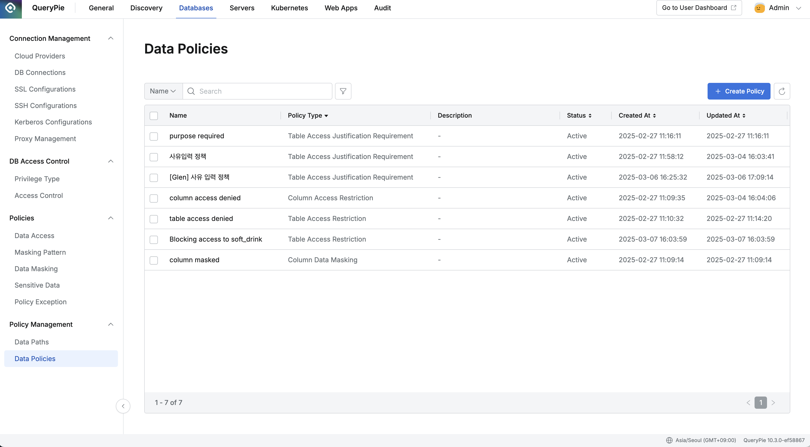

import { Callout } from 'nextra/components'

## Overview

Data Policies는 QueryPie에서 데이터 접근 제어, 데이터 마스킹, 그리고 사용 사유 입력 강제화와 같은 데이터 거버넌스 정책을 설정하고 관리하는 기능입니다. 이 기능을 통해 데이터 보안, 개인정보 보호, 그리고 규정 준수를 관리할 수 있습니다.

## 정책 생성 화면 접근하기

1. 좌측 사이드바에서  **Policy Management**  섹션을 펼칩니다.
2.  **Data Policies**  메뉴를 클릭합니다.
3. 상단의  **Create Policy**  버튼을 클릭하여 정책 생성 화면으로 이동합니다.

## 정책 기본 정보 설정하기

정책 생성 화면의  **Information**  섹션에서 다음 정보를 설정합니다:

1.  **Name** : 정책의 이름을 입력합니다. (필수 입력 항목)
2.  **Policy Type** : 드롭다운 메뉴에서 적용할 정책 유형을 선택합니다. (필수 입력 항목)
3.  **Description** : 정책에 대한 설명을 입력합니다. (선택 사항)

### 정책 타입 소개

QueryPie는 다음과 같은 정책 타입을 제공합니다:

1.  **Column Data Masking** 
    * 컬럼을 대상으로 데이터 마스킹 정책을 적용합니다. 
    * 정규식 기반의 마스킹 패턴을 사용하여 특정 데이터 패턴을 감지하고 마스킹합니다. (Masking Patterns)
    * 사용자가 해당 컬럼을 조회할 때 `{masked}` 형태로 표시되며, 셀을 클릭하면 마스킹 처리된 데이터가 표시됩니다. 
2.  **Table Access Restriction** 
    * 테이블을 대상으로 접근 차단 정책을 적용합니다.
    * 사용자가 해당 테이블을 조회하려고 할 때 접근이 차단되며, 권한 없음 메시지가 표시됩니다.
    * 메시지: `"You don't have permission to access the table 'database.table'. Please check your privileges."` 
3.  **Column Access Restriction** 
    * 컬럼을 대상으로 접근 차단 정책을 적용합니다.
    * 사용자가 해당 컬럼을 조회하려고 할 때 `{restricted}` 형태로 표시되며 접근이 차단됩니다. 
4.  **Table Access Justification Requirement** 
    * 특정 테이블에 대한 작업 시 사유 입력을 강제화합니다.
    * 사용자가 선택된 작업(예: SELECT 쿼리, 데이터 내보내기)을 수행할 때 사유 입력 모달이 표시됩니다.
    * 입력된 사유는 Query Audit의 Execution Reason에 기록됩니다. 
5.  **Sensitive Data Access Monitoring** 
    * 관리자가 특정 테이블 또는 컬럼을 민감 정보로 지정하고 접근할 경우 Alert을 발생시키도록 합니다.
    * 어떤 경로가 민감 정보인지 설정하고 Alert 설정은 General &gt; Company Management &gt; Alert에서 설정합니다. (11.0.0 기준 신정책용 Sensitive Data Access Monitoring Alert 설정 기능은 미구현 상태입니다.)
6.  **DML Query Approval Enforcement**  
    * 특정 테이블에 대해 `INSERT`, `UPDATE`, `DELETE` 쿼리를 수행할 경우 Workflow로 승인 절차를 거치도록 강제합니다.
    * 이 정책을 생성하기 전 General &gt; Workflow Management &gt; Approval Rules에서 SQL Request Type의 Approval Rule을 먼저 생성해 두어야 합니다. `INSERT`, `UPDATE`, `DELETE`를 수행하는 것은 수행하는 사람에게 해당 privilege가 부여되어 있다는 것을 전제로 합니다. 쿼리를 수행하는 사람이 요청자 본인이 되도록 하려면 아래 그림과 같이 Execution 항목의 Assignee for Execution 에 “Allow Assginee selection (All Users)가 선택되어 있어야 `INSERT`, `UPDATE`, `DELETE` 권한이 있지만 관리자가 아닌사람이 승인을 거쳐 쿼리를 수행할 수 있습니다. 
    *  Approval Rule이 생성되어 있으면 아래 그림과 같이 정책과 연계할 Approval Rule을 지정할 수 있습니다. 
    * DML Query Approval Enforcement는 태그로 대상을 지정할 수 없고 specific data path로 특정 경로를 지정해야합니다.

## 정책 적용 대상 설정하기

정책 생성 화면의  **User Scope**  섹션에서 정책이 적용될 사용자 범위를 설정합니다.

### Scope Type

1.  **Everyone** : 모든 사용자에게 정책이 적용됩니다. (기본값)
2.  **Users or Groups** : 선택한 특정 사용자나 그룹에게만 정책이 적용됩니다.
3.  **Attribute of Users**  : 특정 속성이 있는 사용자에게 동적으로 정책을 적용하려는 경우 사용합니다. **[11.1.0]** 

### Exclusions

정책 적용에서 제외할 대상을 설정할 수 있습니다. User scope의 scope type이  **Everyone** 인 경우만 Exclusion 대상을 지정할 수 있습니다. 정책예외(Policy Exception)를 통해 지정하는 상황과 다른 점은 정책 예외는 예외의 기간이 정해져 있지만 Exclusionㄴ 대상은 정책과 동일한 수명주기를 갖는다는 것입니다. 즉, 정책이 존재하는 기간동안 항상 적용됩니다. (정책 적용 대상 = 전체 - exclusions에 지정한 특정 사용자 또는 그룹입니다.)

1.  **None** : 제외 없이 Scope Type에 따라 모든 사용자에게 적용됩니다. (기본값)
2.  **Users and Groups** : 선택한 사용자나 그룹을 정책 적용에서 제외합니다. 

## 정책 적용 타겟 데이터 설정하기

정책 생성 화면의  **Data Scope**  섹션에서 정책이 적용될 데이터를 설정합니다.

### Scope Type

현재는 태그 기반으로만 정책을 적용할 수 있습니다:

1.  **Data tags** : Data Paths 메뉴에서 설정된 태그를 기반으로 정책 적용 대상을 선택합니다.
    * 이 옵션이 선택되면 태그 키와 값을 지정하여 정책을 적용할 테이블 또는 컬럼을 선택할 수 있습니다.
2.  **Specific data path** : 특정 데이터 경로를 직접 지정하는 옵션입니다. (11.0.0 부터)
    * 이 옵션을 선택한 뒤 Add tartget 버튼을 눌러 출력되는 팝업 대화창에서 Database, Schema, Table, Column을 지정할 수 있고 정규표현식을 사용할 수도 있습니다. 

### 정책 저장하기

모든 설정이 완료되면 화면 하단의  **Save**  버튼을 클릭하여 정책을 저장합니다. 저장을 취소하려면  **Cancel**  버튼을 클릭합니다.

<Callout type="important">
**주의사항**
* 정책 설정 시 데이터 태그를 기반으로 하므로, 정책 설정 전에 Data Paths 메뉴에서 적절한 태그가 할당되어 있어야 합니다.
* 정책은 하단에 나열된 데이터베이스 유형만 지원하며, 지원되지 않는 데이터베이스 유형에는 정책을 적용할 수 없습니다.
    *  MySQL, MariaDB, Impala, Single Store, Hive, BigQuery, Oracle, PostgreSQL, SQLServer, Redshift, MS SQL Azure, SAP Hana, Trino, Athena, MongoDB, DocumentDB, Cassandra, ScyllaDB, DynamoDB, Redis
</Callout>
