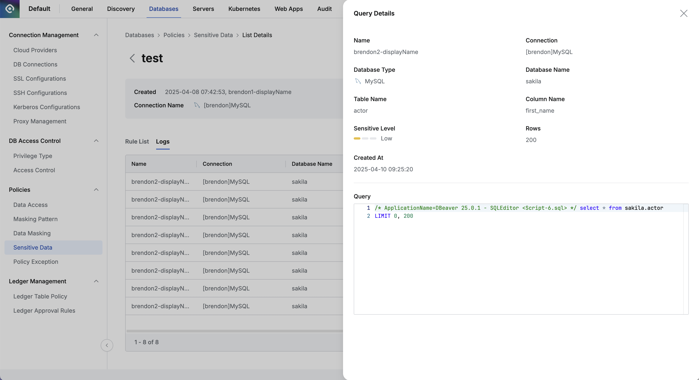

import { Callout } from 'nextra/components'

## Overview

조직 내에서 개인정보 또는 민감정보와 같이 관리가 필요한 데이터를 민감데이터 정책으로 설정하는 방법을 확인할 수 있습니다. Sensitive Data 메뉴에서 정책을 설정할 커넥션을 선택하여 정책을 생성하고, 민감한 데이터를 테이블, 컬럼 기준으로 규칙을 등록하고 관리할 수 있습니다. 정책으로 생성된 경우 별도 로그를 통해 민감데이터에 접근한 기록을 확인할 수 있고 Alert 기능을 통해 알림을 받아볼 수도 있습니다.

## 민감데이터 정책 생성하기

새로운 민감데이터 정책을 커넥션 기준으로 등록합니다.

*Administrator &gt; Databases &gt; Policies &gt; Sensitive Data*

1. Database 설정 메뉴에서 Policies &gt; Sensitive Data 메뉴로 이동합니다.
2. 우측 상단의 `Create Policy` 버튼을 클릭합니다.
3. 정책 생성을 위한 다음의 정보들을 입력합니다.
    1.  **Policy Name**  : 정책을 화면상에서 구별할 수 있는 이름입니다.
    2.  **Target Connection**  : 정책을 적용할 커넥션을 선택합니다. 1개의 정책당 1개의 커넥션을 연결할 수 있습니다.
4. `Save` 버튼을 통해 저장합니다.

해당 정책이 Sensitive Data 정책 목록에 생성된 것을 확인할 수 있습니다.

## 민감데이터 정책에 규칙 등록하기

정책을 생성하고 나면, 실제로 정책을 적용할 데이터의 경로를 규칙으로 등록합니다.

*Administrator &gt; Databases &gt; Policies &gt; Sensitive Data &gt; Rule List*

1. Sensitive Data 메뉴에서 생성한 정책을 클릭합니다.
2. 정책 세부 정보 및 규칙 등록 화면이 표시되고 우측에서 `Add Rule List` 버튼을 클릭합니다.
3. 정책을 적용할 데이터의 경로를 차례대로 선택합니다.
    1.  **Database Name**  : 규칙 등록을 위한 필수 값입니다.
    2.  **Table Name**  : 규칙 등록을 위한 필수 값입니다. 이 경우 해당 테이블 데이터 전체가 민감데이터로 설정됩니다.
    3.  **Column Name**  : 선택한 테이블 내의 특정 컬럼에만 정책을 적용하고 싶은 경우 컬럼을 선택합니다.
4. 정책을 적용할 데이터의 민감도 레벨을 선택합니다.
    1. High, Medium, Low 3가지 레벨 중 하나를 선택합니다.
    2. 선택한 Sensitive Level 정보는 추후 Alert 발송의 트리거 조건으로 설정할 수 있습니다. 
5. `Ok` 버튼 통해 저장합니다.

Rule List 탭에서 규칙이 등록된 것을 확인할 수 있습니다. 이제 사용자가 해당 데이터에 접근할 경우 Logs 탭에서 접근 이력을 확인할 수 있습니다. 민감데이터 정책을 알림으로 설정하려는 경우, [Alerts](Alerts) 문서를 참고하세요.

<Callout type="info">
10.2.8부터 Log 탭에서 볼 수 있는Sensitive data 접근 이력에 사용자가 수행한 쿼리를 포함하도록 개선되었습니다. Log 행을 클릭하면 출력되는 상세 정보에 사용자가 수행한 쿼리를 볼수 있습니다.

*Sensitive Data Log 의 쿼리 내용 표시*

</Callout>

<Callout type="important">
Database Name 선택시 “[ENGINE] [30101] Please Check the user credential or IP ACL settings. Access denied for user ‘username’@’host' (using password: YES)” 오류가 발생합니다.
A. 이 경우, DB 계정 정보 설정이 안되어 있거나 잘못된 정보로 설정되어 있을 수 있습니다. Database Settings &gt; Connection Management &gt; DB Connections 메뉴에서 해당 커넥션 정보 클릭 후,  **Database Username / Password 정보를 입력하고 저장** 한 뒤 다시 시도합니다.
</Callout>
