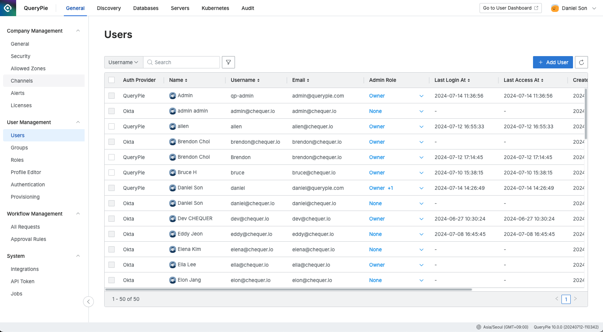
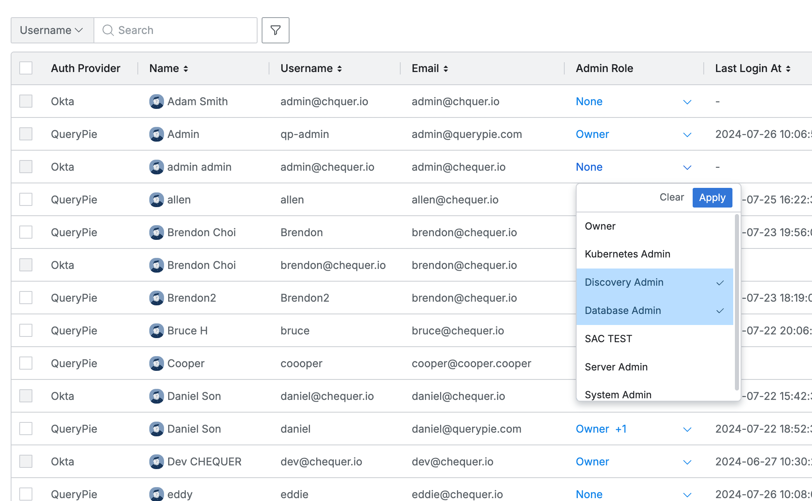
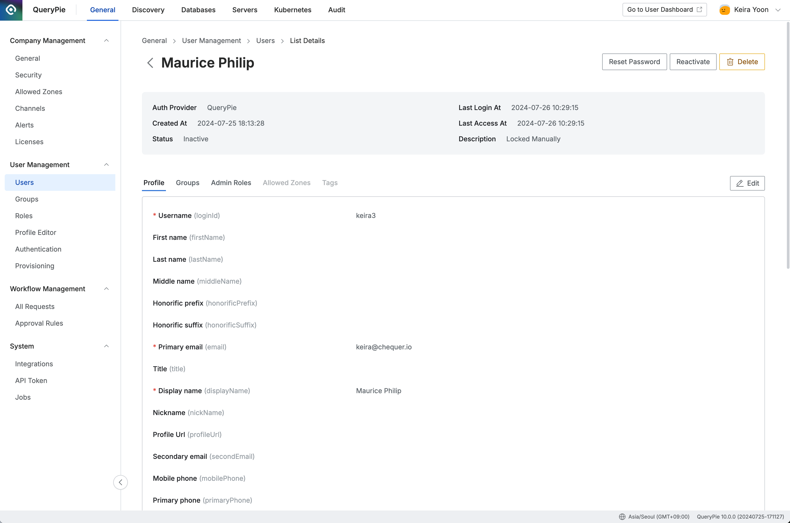
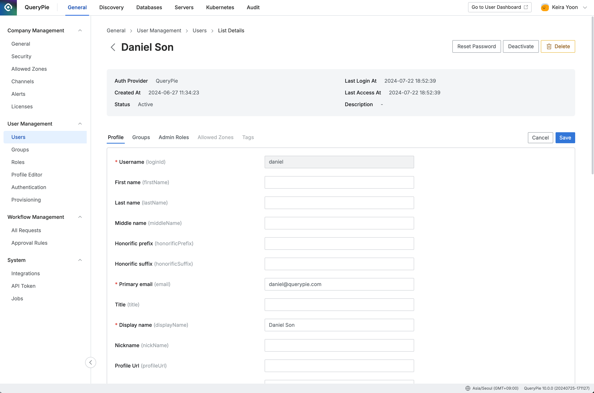
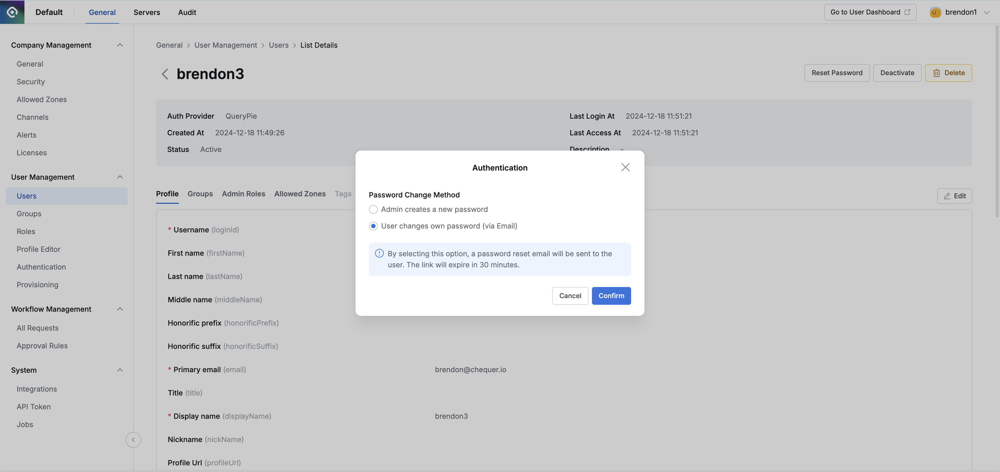
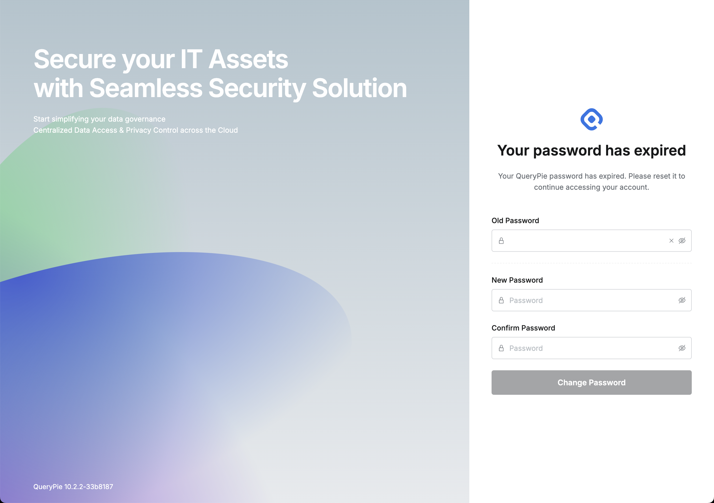
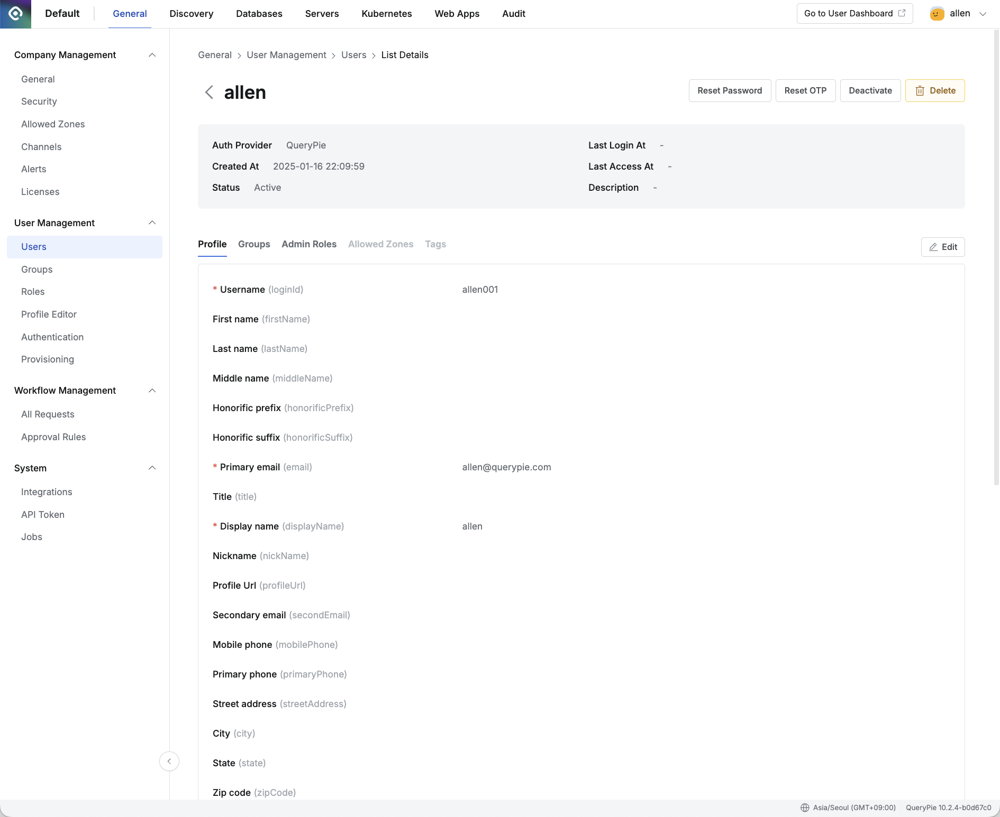

import { Callout } from 'nextra/components'

## Overview

User 페이지에서는 현재 QueryPie에 등록된 사용자 목록을 조회하고, 제반 관리 작업을 수행합니다.

## 사용자 목록 조회하기

User 페이지에서 사용자 목록을 조회할 수 있으며, 검색 및 필터를 제공합니다.

*Administrator &gt; General &gt; User Management &gt; Users*

Users 목록에서 확인 가능한 정보는 다음과 같습니다.

*  **Auth Provider**  : 사용자 인증 제공자
    * QueryPie 또는 User Management &gt; Authentication 에서 설정된 IdP Type을 표시합니다.
    * 수동으로 등록된 사용자의 경우 QueryPie로 표시됩니다.
    * IdP에서 연동된 사용자는 각 ID Provider 이름으로 표시됩니다.
    * Authentication 관련 자세한 내용은 [Authentication](Authentication) 문서를 참고하시기 바랍니다.
*  **Name**  : 사용자 이름 (Display Name)
*  **Username**  : 사용자 로그인 ID
*  **Email**  : 사용자 이메일
*  **Admin Role**  : 사용자에게 부여된 관리자 권한
*  **Last Login At ** : 마지막 로그인 일시
*  **Last Access At**  : 마지막 리소스 접근 일시
*  **Created At ** : 사용자 계정 생성 일시
*  **Description**  : 계정 상태 관련 정보
    * Account Locked Manually : 관리자 또는 API에 의한 비활성화
    * Account Expired : 장기 미접속에 의한 계정 만료
    * Account Locked : 다수의 로그인 실패로 인한 계정 잠김

*Description 유형별 표시*

*  **Status**  : 계정의 활성화 상태 (Active 또는 Inactive)

## 수동으로 사용자 추가

조직에 새로운 사용자를 수동으로 추가합니다. 사용자를 추가한 후 그룹 및 정책에 할당하고 권한을 부여할 수 있습니다.

*Administrator &gt; General &gt; User Management &gt; Users &gt; Add User*

1. Administrator &gt; General &gt; User Management &gt; Users 메뉴로 이동합니다.
2. 우측 상단의 `Add User` 버튼을 클릭합니다.
3. 사용자 추가를 위한 다음의 정보들을 입력합니다.
    1.  **Display Name ** : 쿼리파이 상에서 표기될 사용자의 디스플레이용 이름을 입력합니다. 
    2.  **Username** : 로그인시 사용자는 고유한 값인 Login ID로, 기본적으로 이름이나 이메일 주소의 형태를 입력합니다.
    3.  **Email** : 사용자를 QueryPie 내에서 식별할 수 있는 Unique한 키 값입니다.
    4.  **Password** : 관리자가 설정하는 최초 비밀번호입니다. 사용자 로그인 후 변경하도록 안내해주세요.
4. `Save` 버튼을 통해 저장합니다.

<Callout type="info">
사용자의 Username 항목은 고유한 값으로 최초 추가 이후 수정할 수 없습니다.
</Callout>

해당 사용자가 QueryPie Provider로 Users 목록에 추가된 것을 확인하실 수 있습니다. 기본적으로 Admin 권한이 없는 기본 User로 등록됩니다.

## 사용자에게 관리자 역할 부여 또는 회수하기

<Callout type="important">
Admin Role 을 부여할 수 있는 관리자는 Owner 역할의 사용자만 가능합니다.
</Callout>

사전 정의된 관리자 역할(Admin Role)을 사용자에게 부여 또는 회수할 수 있습니다.

*Administrator &gt; General &gt; User Management &gt; Users*

1.  **Admin Role**  컬럼 내 드롭다운 항목에는 관리자 역할 현황이 표시됩니다.
    * 부여된 권한이 없는 경우 None 으로 표시됩니다.
    * 기부여된 권한이 있는 경우 권한명이 표시됩니다. (여러 개인 경우 +N 형식으로 표시)
2. 드롭다운을 클릭하여, 권한을 추가 또는 삭제할 수 있습니다. (복수 선택 가능)
3. `Clear` 버튼을 클릭하면 모든 권한 선택 내역이 초기화됩니다.
4. `Apply` 버튼을 클릭하면 변경 내역이 저장됩니다.

<Callout type="info">
관리자 역할 자체를 관리하는 방법은 [Roles](Roles) 문서를 참고해주세요.
</Callout>

## 사용자 상세 정보 조회하기

Users 페이지에서 사용자를 클릭하면 상세 정보 페이지로 진입합니다. 등록된 정보의 조회 및 사용자 관리 작업을 수행할 수 있습니다. 사용자 프로필에 등록된 속성으로 Attribute-based Access Control (ABAC)을 구현할 수 있습니다. 사용자 상세 정보는 각각 Profile, Groupts, Admin Roles, Allowed Zones, Tags 탭으로 구분됩니다. 각 항목별 설명은 [사용자 프로필 문서](사용자 프로필)를 참고해주세요.

*Administrator &gt; General &gt; User Management &gt; Users &gt; List Details*

<Callout type="info">
QueryPie를 통해 등록한 사용자만 Profile 정보 수정 및 사용자 삭제가 가능하며, SCIM 연동된 사용자는 원장 데이터 업데이트를 통해 수정사항을 반영하여야 합니다.
</Callout>

## 사용자 비활성화하기

모종의 이유로 사용자 계정을 비활성화해야 할 때, 두 가지 경로로 처리할 수 있습니다.

### Users 페이지에서 비활성화하기

사용자 페이지 내 Status 드롭다운에서, 비활성화 하려는 사용자의 Status 값을 Inactive로 변경합니다.

사유 입력 모달이 출력되면 변경 사유를 입력 후 `OK` 버튼을 클릭하여 변경을 완료합니다.

*Administrator &gt; General &gt; User Management &gt; Users*

### 상세 페이지에서 비활성화하기

사용자 상세 페이지에서 `Deactivate` 버튼을 클릭하면 사유 입력 모달이 출력됩니다.

사유 입력 후 `OK` 버튼을 클릭하면 사용자 비활성화가 완료됩니다.

*Administrator &gt; General &gt; User Management &gt; Users &gt; List Details *

<Callout type="info">
비활성화 처리된 사용자의 계정 상태는 Inactive, Description에는 Locked Manually 로 표시됩니다.
</Callout>

## 사용자 재활성화하기

관리자에 의해 수동으로 비활성화 되었거나, 장기 미접속으로 인해 비활성화 처리된 사용자의 계정 상태는 Inactive 로 표시됩니다. 이러한 사용자 계정을 다시 활성화하는 방법은 크게 두가지입니다.

### Users 페이지에서 재활성화하기

사용자 페이지 내 Status 드롭다운에서, 재활성화 하려는 사용자의 Status 값을 Active로 변경합니다. 사유 입력 모달이 출력되면 변경 사유를 입력 후 `OK` 버튼을 클릭하여 변경을 완료합니다.

*Administrator &gt; General &gt; User Management &gt; Users*

### 사용자 상세 페이지에서 재활성화하기

비활성화된 사용자의 상세 페이지에서 `Reactivate` 버튼을 클릭합니다. 사유 입력 모달이 출력되면 변경 사유를 입력 후 `OK` 버튼을 클릭하여 변경을 완료합니다.

*Administrator &gt; General &gt; User Management &gt; Users &gt; List Details *

## 사용자 정보 수정하기

<Callout type="important">
QueryPie에서 수동으로 등록한 사용자의 정보만 수정가능합니다. SCIM을 통해 연동해온 사용자 정보 수정은 원장 데이터 업데이트 후 동기화를 거쳐 가능합니다.
</Callout>

사용자 상세 페이지에서 `Edit` 버튼을 클릭하면 수정 모드로 진입합니다. 수정 가능한 필드는 활성화됩니다. 입력 완료 후 `Save` 버튼을 눌러 수정을 완료합니다.

*Administrator &gt; General &gt; User Management &gt; Users &gt; List Details &gt; Edit*

## 사용자 삭제하기

<Callout type="important">
QueryPie에서 수동으로 등록한 사용자만 직접 삭제 가능합니다. SCIM을 통해 연동해온 사용자 삭제는 원장 데이터 업데이트 후 동기화를 거쳐 가능합니다.
</Callout>

사용자 상세 페이지에서 `Delete` 버튼을 클릭하면 Delete User 확인 모달이 노출됩니다.

확인 문구로 “DELETE” 를 입력한 뒤 `Delete` 버튼을 누르면 삭제가 완료됩니다.

*Administrator &gt; General &gt; User Management &gt; Users &gt; List Details &gt; Delete User*

## 사용자 비밀번호 재설정하기

<Callout type="important">
QueryPie에서 수동으로 등록한 사용자만 비밀번호 재설정이 가능합니다. SCIM을 통해 연동해온 사용자의 인증 수단은 SCIM에서 관리하고 있습니다.
</Callout>

비밀번호 재설정은 임시 비밀번호 발급을 통해서 진행됩니다. 관리자는 사용자 상세페이지에서 임시 비밀번호를 발급한 뒤 사용자에게 임시 비밀번호를 안내해야 합니다.

### 임시 비밀번호 발급

*Administrator &gt; General &gt; User Management &gt; Users &gt; List Details &gt; Authentication*

1. 비밀번호를 재설정하려는 사용자의 상세 페이지에서 `Reset Password` 버튼을 클릭하면 인증 확인 모달이 노출됩니다.
2. 임시 비밀번호를 입력 후 `Confirm` 버튼을 누르면 임시 비밀번호 발급이 완료됩니다.

<Callout type="info">
QueryPie 10.2.2부터 Email 연동 설정이 되어 있는 경우, 관리자가 임시 비밀번호를 지정하는 대신 사용자가 직접 자신의 비밀 번호를 초기화하도록 초기화 메일을 발송 할 수 있습니다.

1. 관리자가 사용자 상세페이지에서 `Reset Password` 버튼을 클릭합니다.
2. 출력되는 팝업 창의 “Password change method”에서 “User changes own password (via email)”을 선택하고 `Confirm` 버튼을 누르면 비밀번호 초기화 메일이 해당 사용자의 email 주소로 발송됩니다.

*Email을 통해 사용자가 자신의 패스워드를 직접 초기화하도록 선택*

사용자가 수신하게 되는 메일의 내용은 아래와 유사합니다. 비밀번호 초기화 링크는 30분동안 유효합니다. 만약 30분이 넘게 사용자가 이 링크로 접속하지 않는다면, 이 링크로 비밀번호를 초기화 할 수 없으므로 관리자가 다시 위 절차(User changes own password (via email))를 수행하여 비밀번호 초기화 메일을 발송해줘야 합니다.

*비밀번호 초기화 이메일*

</Callout>

### 비밀번호 재설정 (사용자)

사용자가 로그인 할 때 앞에서 설정한 임시 비밀번호를 입력하면, 곧바로 비밀번호 재설정 화면으로 진입됩니다. 비밀번호를 변경한 뒤 `Change Password` 버튼을 클릭하면 비밀번호 변경이 완료되며, 새로운 비밀번호로 로그인할 수 있습니다.

*비밀번호 재설정 화면*

## 사용자 OTP 재설정하기

Users 페이지에서 사용자를 클릭하면 상세 정보 페이지로 진입합니다. OTP를 통해 2차 인증을 설정한 경우, OTP 재설정 기능을 제공합니다. OTP 재설정 후, 사용자는 자신의 OTP를 다시 설정해야 합니다. OTP를 다시 설정하는 방법은 [My Dashboard](My Dashboard) 문서를 참고해주세요.

### 사용자 OTP 재설정

사용자의 상세 페이지에서 `Reset OTP` 버튼을 클릭합니다. 경고 모달이 출력되면 `Reset` 버튼을 클릭하여 변경을 재설정을 완료합니다.

*Administrator &gt; General &gt; User Management &gt; Users &gt; List Details*

