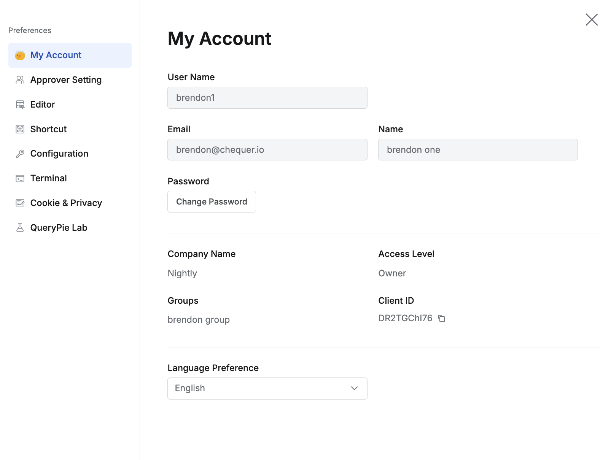
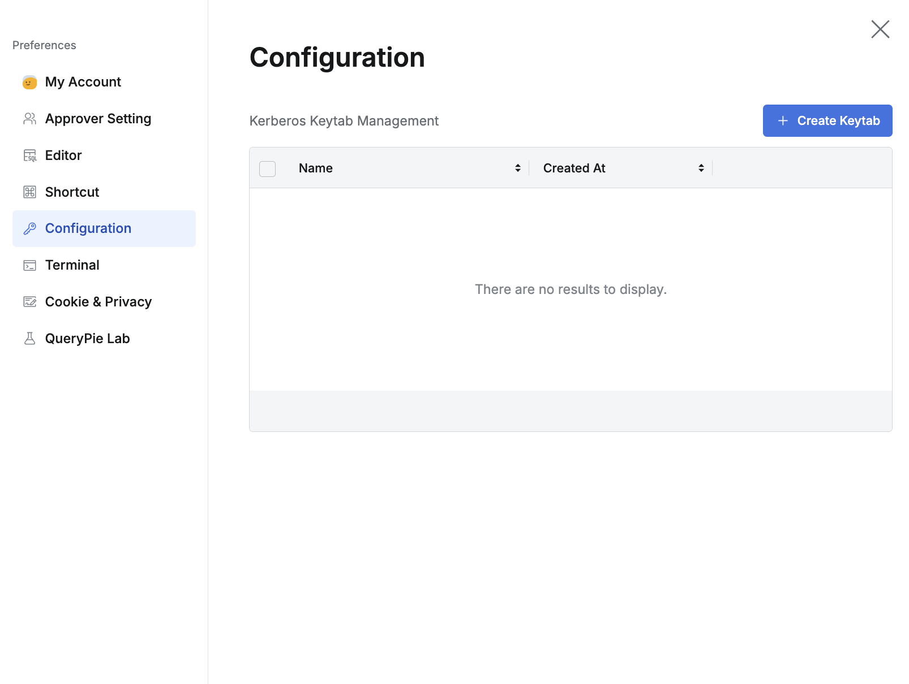
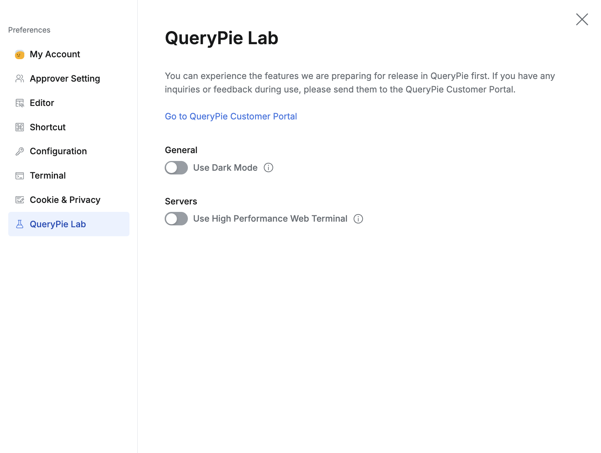

import { Callout } from 'nextra/components'

## Overview

Preference 화면을 통해 QueryPie 사용자의 개인 별 환경을 설정할 수 있습니다.

## 사용자 계정 메뉴의 Preference 버튼

개별 사용자의 환경설정을 하려면 상단 메뉴바 우측의 사용자 계정을 클릭하고, 메뉴에서 Preferences 버튼을 클릭합니다.

## My Account

My Account 탭에서는 사용자 계정 정보를 확인하고 비밀번호를 변경할 수 있습니다.

<Callout type="info">
비밀번호 변경 기능은 QueryPie에서 생성한 계정에서만 지원됩니다. SSO Login 사용 시 비밀번호 변경은 QueryPie가 아닌 개별 IdP의 사용자 설정 기능을 이용해주세요.
</Callout>

*상단 메뉴바 &gt; Profile &gt; Preferences &gt; My Account*

*  **Language Preference**  : 사용자는 자신이 원하는 표시 언어를 선택할 수 있으며 컨펌 모달이 나타나면 OK 버튼을 눌러 적용할 수 있습니다. 언어 설정이 적용되는 즉시 사용자의 페이지가 리로드 됩니다. 
    * 현재 이하의 언어가 지원되며, 영어 외 언어는 Beta로 일부 메뉴에 대해서는 영문 표기 그대로 남을 수 있는 점 공유드립니다. 
        * 영어
        * 한국어 **[Beta]** 
        * 일본어 **[Beta]** 

<Callout type="important">
해당 설정은 사용자 브라우저의 로컬 스토리지에 저장됩니다. 로컬 스토리지가 초기화될 시, 사용자는 본 언어 설정을 다시 저장해주셔야 합니다.
</Callout>

## Approval Settings

Approval Settings 탭에서는 대리 결재를 설정할 수 있습니다.

<Callout type="info">
자세한 대리결재 기능 사용 방법은 [결재 부가 기능 (대리 결재, 재상신 등)](결재 부가 기능 (대리 결재, 재상신 등)) 문서를 참고해주세요.
</Callout>

*상단 메뉴바 &gt; Profile &gt; Preferences &gt; Approver Settings*

*  **Delegate Approval to**  : 대리결재자 입력 (1명의 사용자만 선택 가능)
*  **Start Date**  : 대리결재 시작일자
*  **End Date**  : 대리결재 종료일자
*  **Delegation Reason**  : 대리결재 설정 사유 입력 (선택사항)

## Editor

Editor 탭에서는 SQL 에디터 표시 방식 및 기능을 설정합니다.

*상단 메뉴바 &gt; Profile &gt; Preferences &gt; Editor*

*  **Theme ** : Light 또는 Dark 테마를 설정할 수 있습니다. 
*  **Editor**  : 다음과 같은 에디터 설정을 할 수 있습니다. 
    *  **Font Size**  : 폰트 크기 지정
    *  **Tab Size**  : 탭 들여쓰기 너비 지정
    *  **Auto Complete**  : 주요 쿼리에 대한 자동 완성 활성화 여부
    *  **Automatic Line Change**  : 자동 줄바꿈 (wrap 기능) 활성화 여부
    *  **Full Scan Warning**  : 쿼리 실행시, DB 전체 스캔이 포함될 수 있는 쿼리에 대해 경고하는 기능 활성화 여부
*  **Grid ** : 그리드 설정 (테이블 형식으로 표시되는 모든 부분에 적용됨)
    *  **Font Size**  : 폰트 크기 지정
    *  **Row Height**  : 열 높이 지정 (em)
        * eg. 2 em = `{Font Size}`*2
    *  **How to show NULL item ** : 해당 셀에 값이 없을 경우 표시방식 (Default : NULL)

## Shortcut

Shortcut 탭에서는 SQL Editor에 적용되는 단축키를 조회하고 더블클릭하여 수정할 수 있습니다.

*상단 메뉴바 &gt; Profile &gt; Preferences &gt; Shortcut*

## Configuration

Configuration 탭에서는 커버로스 키탭을 관리할 수 있습니다. `Create Keatab` 을 눌러 키탭 파일을 업로드하세요.

*상단 메뉴바 &gt; Profile &gt; Preferences &gt; Configuration*

## Terminal

Terminal 탭에서 SSH등 텍스트 기반 접속에 보여지는 사용자 페이지의 글꼴 크기(기본 12, 최소 9, 최대 24)와 색 테마를 지정할 수 있습니다.

*상단 메뉴바 &gt; Profile &gt; Preferences &gt; Terminal*

## Cookie & Privacy

사용자 경험을 향상시키기 위해 수집하는 선택적 분석용 쿠키 사용에 대한 동의 또는 거부를 할 수 있고 QueryPie 개인정보 처리지침(Privacy Policy)을 확인 할 수 있습니다. 인터넷과 연결되어 있지 않은 폐쇄망에서는 쿠키 정보가 외부로 전송되지 않습니다. 개인정보 처리지침은 인터넷의 QueryPie 홈페이지에 접속가능한 상태에서만 볼 수 있습니다. [https://www.querypie.com/privacy-policy](https://www.querypie.com/privacy-policy) (영어) [https://www.querypie.com/ko/privacy-policy](https://www.querypie.com/ko/privacy-policy) (한국어) [https://www.querypie.com/ja/privacy-policy](https://www.querypie.com/ja/privacy-policy) (일본어)

*상단 메뉴바 &gt; Profile &gt; Preferences &gt; Terminal*

## QueryPie Lab

QueryPie Lab 탭에서는 실험실 기능을 제공하며, 다크모드, 고성능 웹 터미널 기능등 실험적 기능을 체험해 볼 수 있습니다.

<Callout type="important">
실험실 기능은 다소 안정성이 떨어질 수 있으며 버전 업데이트 시 제거될 수 있습니다.
</Callout>

*상단 메뉴바 &gt; Profile &gt; Preferences &gt; QueryPie Lab*

*  **Use Dark Mode :**  브라우저 설정과 관계없이 QueryPie 개별적으로 다크 모드를 사용할 수 있습니다.
*  **Use High Performance Web Terminal ** : 메모리 최적화 기술이 적용되어 여러 세션을 동시에 사용하거나 방대한 양의 로그 파일을 탐색하는 등 높은 메모리 성능을 요구하는 작업에 적합합니다.
