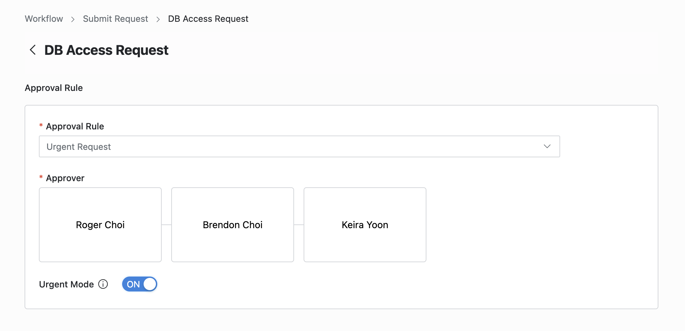
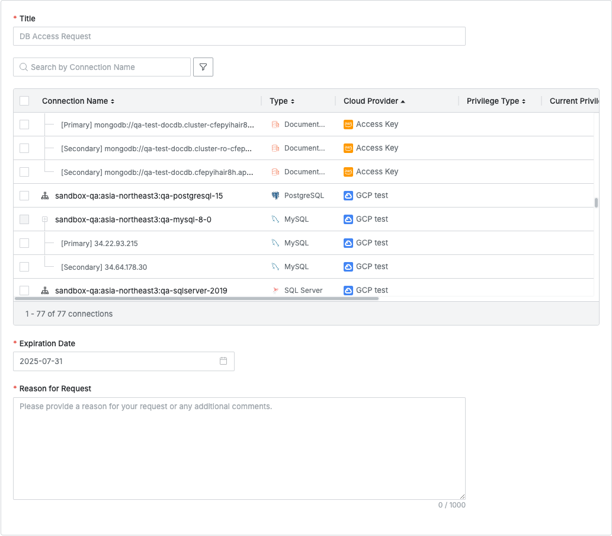

import { Callout } from 'nextra/components'

## Overview

아래 순서에 따라 접근이 필요한 DB 커넥션에 대한 Privilege를 요청할 수 있습니다. 요청 후 승인이 완료될 경우 즉시 권한이 부여되며 QueryPie Web에 있는 SQL Editor 또는 Agent를 통해 권한을 받은 커넥션에 접속할 수 있습니다.

## DB Access Request 요청하기

### 1. 결재 규칙 선택하기

* Approval Rule을 선택하여 목적에 맞는 결재 규칙을 선택하세요. 선택한 규칙에 따라 승인 대상이 달라집니다. 
* 만약 관리자가 승인자를 지정한 결재 규칙이 선택된 경우, 자동으로 승인자가 지정되며 추가 및 변경이 불가합니다.

### 2. 승인자 지정하기

* 결재 라인에서 `+` 버튼을 누르면 단계별 승인자를 지정할 수 있는 팝업창이 표시됩니다. 
* 이 팝업창에서 결재 승인 조건 및 승인자를 추가 후 `Save` 버튼을 눌러 결재 라인을 저장합니다.
* 선택 가능한 승인 조건은 다음과 같습니다. 
    * A single Assignee can complete the approval request : 여러 명 중 한 명의 승인만으로 결재 요청이 승인 처리됩니다.
    * All Assignees must approve this request : 모든 승인자가 승인하여야 결재 요청이 승인 처리됩니다.

### 3. 참조자 지정하기

* 결재 라인에서 `+` 버튼을 누르면 참조자를 지정할 수 있는 팝업창이 표시됩니다. 
    * 관리자가 참조자 지정을 허용하지 않은 경우에는 Reviewer 박스가 표시되지 않습니다. 
* 이 팝업창에서 결재 승인 조건 및 승인자를 추가합니다. 
* `Save` 버튼을 눌러 모달을 닫고 참조자 지정을 완료합니다.

### 4. 사후 승인으로 요청 보내기

* 사후 승인 기능이 허용된 결재 규칙을 선택한 경우 Urgent Mode 스위치가 표시됩니다. 
* Urgent mode = On 으로 설정 후 결재 요청을 등록하면 즉시 권한을 부여받거나 작업을 수행할 수 있습니다.

<Callout type="important">
**Q. Urgent Mode 스위치가 보이지 않아요.**
A. 관리자가 Urgent Mode를 허용하지 않은 결재 규칙을 선택한 경우, 해당 기능이 표시되지 않습니다.
</Callout>

### 5. 요청 정보 입력하기

*  **Title**  : 요청 제목을 입력합니다. 
*  **Expiration Date**  : 요청 권한의 만료일자를 입력합니다. 기본값은 1년입니다.
*  **Reason for Request**  : 접근 권한을 요청하는 사유를 입력합니다. 

*User &gt; Workflow &gt; Submit Request &gt; DB Access Request &gt; Request Summary*

### 6. 요청할 DB 커넥션 선택 및 권한 지정하기

* Request Summary 영역 내 테이블에는 현재 QueryPie에 등록되어 있는 DB 커넥션 목록이 표시됩니다. 
    *  **Privilege Type**  : 특정 DB 커넥션에 요청할 Privilege Type을 지정하면 그 값이 표시됩니다. 
    *  **Current Privilege**  : 해당 커넥션의 현재 권한을 표시합니다. 현재 접근 권한이 없는 경우 비어있습니다.
    *  **Expiration Date**  : 현재 해당 커넥션에 부여되어 있는 권한의 만료일자를 표시합니다.
* 접근 권한을 요청할 DB 커넥션을 체크박스로 선택 후 아래 두가지 방법으로 Privilege Type을 선택할 수 있습니다.

*드롭다운을 통해 커넥션 별로 지정*

*체크박스 및 Apply 버튼을 통한 일괄 적용*

* 선택 가능한 Privilege Type은 다음과 같습니다. 
    *  **Read/Write 권한**  : 전체 권한입니다. 
    *  **Read-Only 권한**  : SELECT만 가능한 권한입니다.
    *  **기타 권한**  : 관리자가 추가로 생성한 권한이며 생성한 권한이 없다면 위 두 가지 권한만 표시됩니다. 
* 결재 규칙 지정 및 요청 본문 입력이 완료되었다면 페이지 하단의 `Submit` 버튼을 눌러 요청을 상신합니다.
